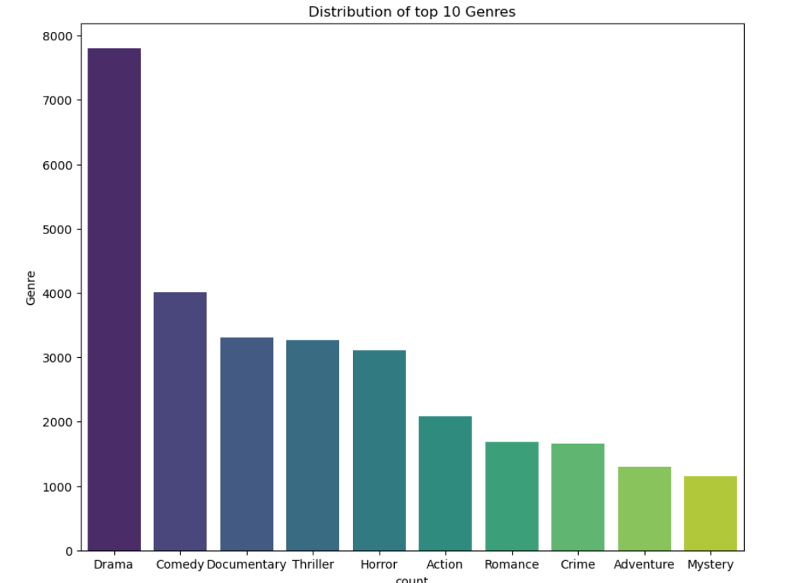
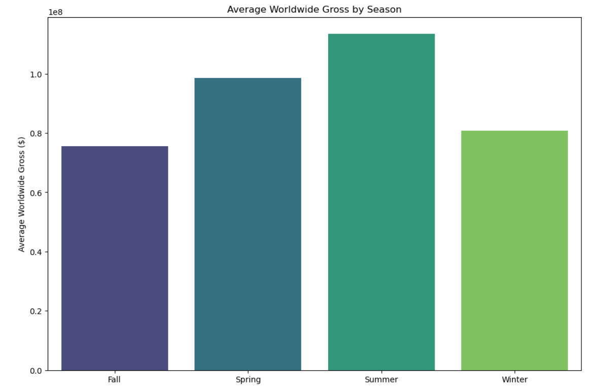
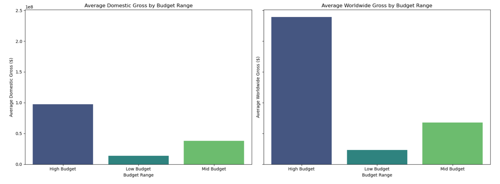
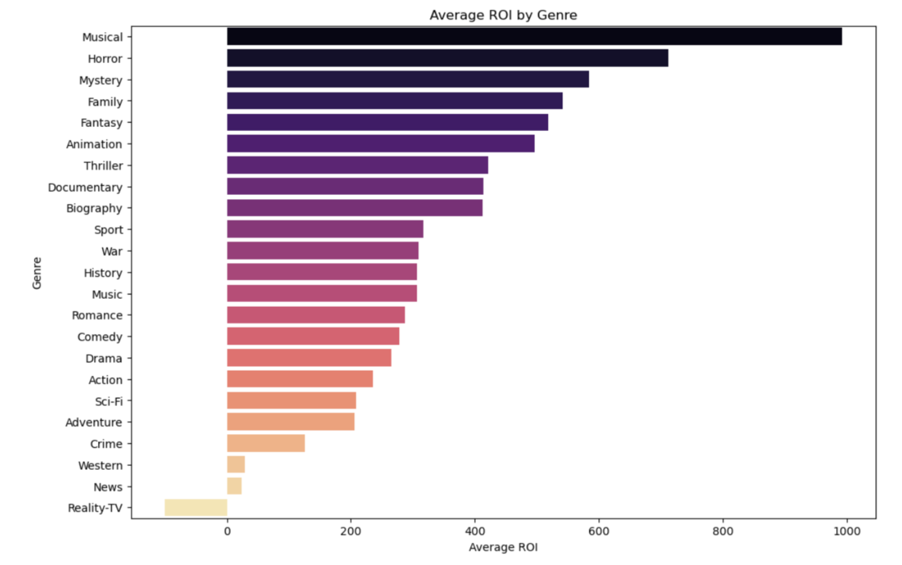

# Film Production Analysis

## Overview
- **Project Goal:** To analyze film data to provide actionable insights for a new movie studio aiming to enter the market and produce successful films.
- **Focus:** Identify trends and key factors that influence box office success, including genres, release timing, and budget ranges.

## Business Understanding
### Stakeholders
Business stakeholders including executives and decision-makers of the new movie studio.

### Key Business Questions
1. What genres of films are currently performing the best?
2. When is the best time to release a new film?
3. How does production budget impact box office success?

## Data Understanding and Analysis
### Source of Data
1. [Box Office Mojo](https://www.boxofficemojo.com/): Comprehensive box office revenue data.
2. [IMDB](https://www.imdb.com/): Detailed movie ratings, genres, and other information.
3. [Rotten Tomatoes](https://www.rottentomatoes.com/): Critical and audience reviews and ratings.
4. [TheMovieDB](https://www.themoviedb.org/): Genres, ratings, and runtime information.
5. [The Numbers](https://www.the-numbers.com/): Financial data on movie budgets and grosses.

### Description of Data
- **Production Budget:** The cost to produce a film.
- **Gross Revenues:** Box office earnings, both domestic and worldwide.
- **Release Date:** Timing of film release which impacts its performance.
- **Genres:** Categories of films that indicate the type of content.
- **Original Language:** The primary language in which the film was produced.
- **Runtime Minutes:** The length of the film in minutes.
- **Average Rating:** The average rating received from audiences and critics.

### Visualizations
1. **Analyzing distribution of top produced genres:**

This bar chart shows the top produced genres are drama (7805), comedy(4014) and documentary (3304).

2. **Analyzing seasonal trends for movie releases:**

This chart indicates that most movies perform best in the summer with an average worldwide gross of $113M and least in the fall averagely $75M.

3. **Analyzing performance of films in different budget ranges:**

The chart tells that the higher the production budget the higher the returns both domestic ($97M) and worldwide ($238M). 

4. **Identifying genres with the highest ROI:**

Musical films have the highest return on investment (991.36) followed by horror (712.20) and Mystery (584.23).

For Tableau highlights and visualization of the analysis, refer to this [Movie Analysis Workbook](https://public.tableau.com/views/MovieAnalysisworkbook_17221011976360/MovieAnalysisDashboard?:language=en-US&publish=yes&:sid=&:redirect=auth&:display_count=n&:origin=viz_share_link).

## Conclusion
### Summary of Conclusions
- **Genre Selection:** Musicals, Horror, and Mystery genres offer the highest ROI.
- **Release Timing:** Summer releases yield the highest average worldwide gross.
- **Budget Management:** Mid to high-budget films show a strong positive correlation with gross revenue.

### Three Relevant Findings
- Films released in summer perform better on average.
- High-budget films tend to have higher gross revenues.
- Certain genres consistently receive high audience ratings and box office returns.

## Presentation
If PDF file presentation fails to open, access the slides [here](https://www.canva.com/design/DAGMHsKOaUE/-zGn5ouqB3sSGfgH8yqWsg/edit?utm_content=DAGMHsKOaUE&utm_campaign=designshare&utm_medium=link2&utm_source=sharebutton).

## How to Use the Project
1. Clone the repository to your local machine. Use `git clone <repo_url>`
2. Install Dependencies by running `pip install -r requirements.txt` to install necessary Python packages.
3. Navigate to the project directory.
4. Launch Jupyter Notebook by running jupyter notebook in the terminal.
5. Open the `film_production_analysis.ipynb` notebook.
6. Follow the instructions and execute the cells in the notebook to replicate the analysis steps.